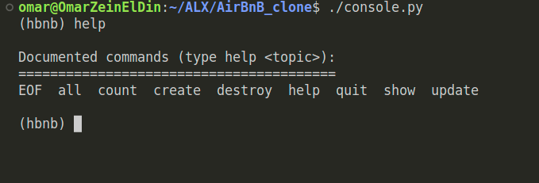
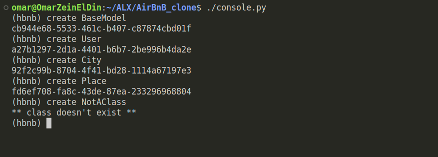

# AirBnB Clone

This is the README file for the AirBnB Clone project. This project aims to create a simplified version of the AirBnB platform, implementing various functionalities and features.

## BaseModel

The `BaseModel` class serves as the foundation for other classes within the project. It defines common attributes and methods that are shared among multiple classes. Here are the details of the `BaseModel` class:

### Public instance attributes

- `id`: A unique identifier assigned to each instance. It is generated using `uuid.uuid4()` and converted to a string.
- `created_at`: A datetime object representing the timestamp when an instance is created.
- `updated_at`: A datetime object representing the timestamp when an instance is created or updated.

### Public instance methods

- `save(self)`: Updates the `updated_at` attribute with the current datetime.
- `to_dict(self)`: Returns a dictionary representation of the instance. It includes all the instance attributes stored in `__dict__` converted to a dictionary format. The `created_at` and `updated_at` attributes are converted to string objects in ISO format.

## File Storage Engine

The project uses a file storage engine to serialize instances to JSON files and deserialize JSON files to instances. The file storage engine is implemented in the `models/engine/file_storage.py` file. Here are the specifications:

### Private class attributes

- `__file_path`: A string representing the path to the JSON file (e.g., `file.json`).
- `__objects`: A dictionary that stores all objects by `<class name>.id` (e.g., to store a `BaseModel` object with `id=12121212`, the key will be `BaseModel.12121212`).

## Console Interface using hbnb package

The AirBnB Clone project provides a console interface for interacting with the application. The interface is implemented using the `hbnb` package in Python. Here are the available commands:

1. `quit`:
   - Description: Exits the program.
   - Usage: `quit`
   - Example:
    
2. `EOF`:
   - Description: Exits the program.
   - Usage: Pressing Ctrl + D (EOF)
   - Example: `(hbnb) [Press Ctrl + D]`

3. `help`:
   - Description: Displays the available commands and their usage.
   - Usage: `help`
   - Example: `(hbnb) help`
   

4. `create <Class_name>`:
   - Usage: `create <Class_name>`
   - Description: Creates a new instance of the specified class.
   - Example: `(hbnb) create BaseModel`
    
  
5. `show <Class_name> <ID>`:
   - Description: Shows the details of a specific instance.
   - Usage1: `show <Class_name> <ID>`
   - Usage2: `<Class_name>.show(<ID>)`
   - Example:
    

6. `destroy <Class_name> <ID>`:
   - Description: Deletes a specific instance.
   - Usage1: `destroy <Class_name> <ID>`
   - Usage2: `<Class_name>.destroy(<ID>)`
   - Example:
    

7. `all`:
   - Description: Shows all instances from all classes.
   - Usage1: `all`
   - Example:
    

8. `all <Class_name>`:
   - Description: Shows all instances of a specific class.
   - Usage1: `all <Class_name>`
   - Usage2: `<Class_name>.all()`
   - Example:
    

9. `update <Class_name> <ID> <attribute_name> <attribute_value>`:
   - Description: Updates the value of a specific attribute of an instance.
   - Usage1: `update <Class_name> <ID> <attribute_name> <attribute_value>`
   - Usage2: `<Class_name>.update(<ID>, <attribute_name>, <attribute_value>)`
   - Example:
    

10. `count <Class_name>`

    - Description: retrieve the number of instances of a class
    - Usage1: `count <Class_name>`
    - Usage2: `<Class_name>.count()`
    - Example:
    

## Authors

[Omar Khaled](https://github.com/Omarkhaled711)

[Rima Mertah](https://github.com/clairima)

## Credits

This project is a part of Alx software engineering track.
